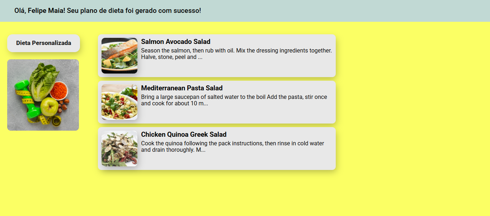
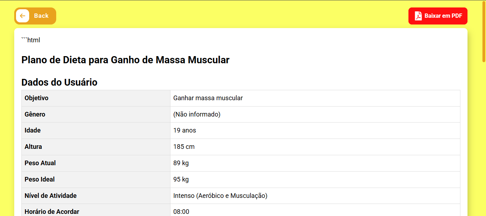
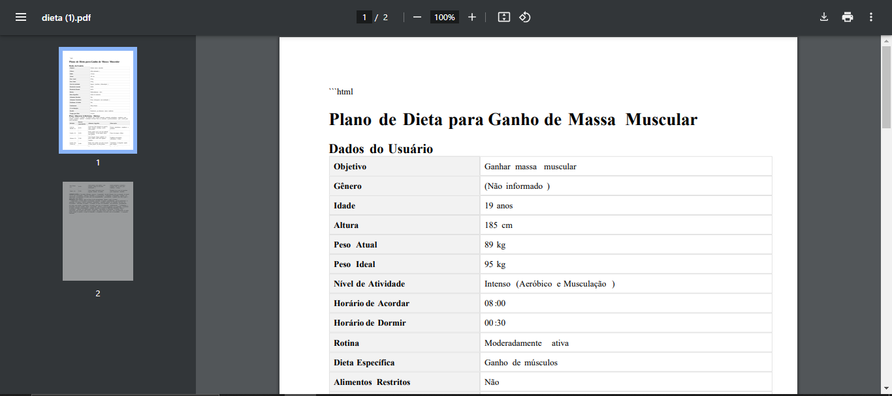

# FitAI

O FitAI é uma aplicação de saúde e fitness que utiliza inteligência artificial para oferecer planos personalizados de dieta, adaptados às necessidades e objetivos
individuais dos usuários.

## Status
🚧 Projeto Finalizado (possiveis mudanças no futuro) 🚧

## Pré-visualização
Confira uma prévia do Conecta:







---

## Funcionalidades
- ✅ Cadastro e Autenticação de Usuários
- ✅ Questionário para Personalização da Dieta
- ✅ Geração Automática de Dietas
- ✅ Exportação da dieta para PDF.
- ✅ Recomendações de receitas baseadas nas preferências do usuário.
- ✅ API de receitas

---

## Como Começar

### Pré-requisitos
Certifique-se de ter instalado:
- **Node.js** (v16 ou superior)
- **MySQL**
- **Git**

### Criação do Banco de Dados

#### BD `fitai`
Cria o BD do projeto.
```bash
CREATE DATABASE NOME_AQUI;
```

#### Tabela `users`
Guarda informações sobre os usuários.
```bash
CREATE TABLE users (
    id INT AUTO_INCREMENT PRIMARY KEY,
    username VARCHAR(199) NOT NULL,
    email VARCHAR(100) NOT NULL,
    password VARCHAR(255) NOT NULL UNIQUE,
    profile_image VARCHAR(255),
    position VARCHAR(255),
    leader_code VARCHAR(255),
    leader_id INT
);
```

#### Tabela `quiz_responses`
Armazena os dados do usuário para criar a dieta personalizada
```bash
  CREATE TABLE quiz_responses (
    id INT AUTO_INCREMENT PRIMARY KEY,
    user_id INT NOT NULL,
    objetivo VARCHAR(255) NOT NULL,
    genero VARCHAR(10) NOT NULL,
    idade INT NOT NULL,
    altura DECIMAL(5,2) NOT NULL,
    peso_atual DECIMAL(5,2) NOT NULL,
    peso_ideal DECIMAL(5,2) NOT NULL,
    nivel_atividade VARCHAR(150) NOT NULL,
    tipo_atividade VARCHAR(200) NOT NULL,
    horario_acordar TIME NOT NULL,
    horario_dormir TIME NOT NULL,
    rotina VARCHAR(150) NOT NULL,
    dieta_especifica VARCHAR(255) NOT NULL,
    alimentos_restritos TEXT NOT NULL,
    alimentos_preferidos TEXT NOT NULL,
    prefere_refeicoes VARCHAR(150) NOT NULL,
    problema_saude TEXT NOT NULL,
    suplementos TEXT NOT NULL,
    numero_refeicoes INT NOT NULL,
    tipo_desafio VARCHAR(200) NOT NULL,
    tempo_meta VARCHAR(100) NOT NULL,
    respondido TINYINT(1) NOT NULL DEFAULT 0
);
```

#### Tabela `diets`
Armazena a dieta criada pelo gemini
```bash
  CREATE TABLE diets (
    id INT AUTO_INCREMENT PRIMARY KEY,
    user_id INT NOT NULL,
    diet_plan TEXT NOT NULL,
    FOREIGN KEY (user_id) REFERENCES users(id) ON DELETE CASCADE
);
```

### Instalação

1. Clone o repositório:
    ```bash
    git clone https://github.com/fel1pee3/FitAI.git
    cd conecta
    ```

2. Instale as dependências do backend:
    ```bash
    cd backend
    npm install
    ```

3. Configure o arquivo `.env` no backend:
    ```env
    DB_HOST="localhost"
    DB_USER="root"
    DB_PASSWORD="SUA-SENHA"
    DB_DATABASE="conecta"
    PORT=3000
    JWT_KEY="SUA-CHAVE-JWT"
    GOOGLE_API_KEY="CHAVE-GEMINI"
    ```

4. Inicie o backend:
    ```bash
    npm start
    ```

5. Instale as dependências do frontend:
    ```bash
    cd ../frontend
    npm install
    ```

6. Inicie o frontend:
    ```bash
    npm run dev
    ```

7. Acesse a aplicação em `http://localhost:3000`.

---

## Licença
Este projeto está licenciado sob a licença **MIT**.

